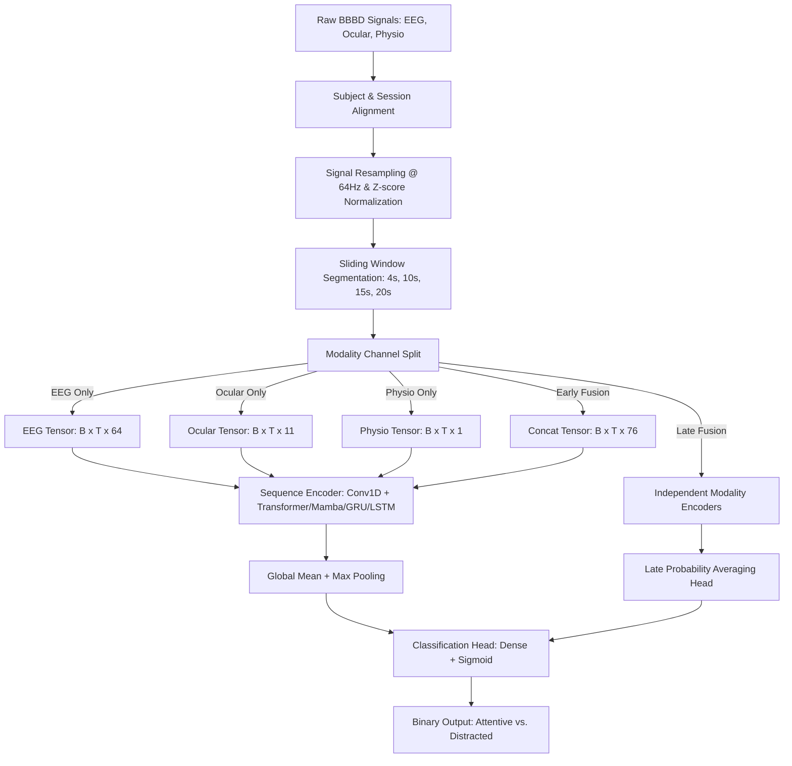

# BBBD Multimodal Attention Detection & Mind-Wandering Study

[](https://www.python.org/)
[](https://pytorch.org/)
[](https://nature.com/articles/s41597-026-07215-1)

This repository contains the complete experimental pipeline, deep learning models, cross-experiment evaluation framework, and analytical results for classifying cognitive states (**Attentive vs. Distracted / Mind-Wandering**) using the **Brain, Body, and Behavior Dataset (BBBD)**.

---

## 📌 Table of Contents
1. [Executive Summary](#-executive-summary)
2. [Dataset Overview](#-dataset-overview)
3. [Repository Structure](#-repository-structure)
4. [Data Processing & Fusion Pipeline](#-data-processing--fusion-pipeline)
5. [Model Architectures](#-model-architectures)
6. [Experimental Results & Outcomes](#-experimental-results--outcomes)
7. [Execution Guide](#-execution-guide)
8. [Summary of Artifacts & Outputs](#-summary-of-artifacts--outputs)

---

## 🧠 Executive Summary

The primary goal of this project is to detect and model human attention retention and mind-wandering during educational video watching using continuous multimodal physiological signals:
* **Binary Classification:** Differentiating between standard video viewing (**Attentive**) and secondary-task cognitive load (**Distracted**, e.g., silent backward counting).
* **Multimodal Signals:** 64-channel EEG, 11-dimensional Eye-tracking & Pose (Ocular), and 1-dimensional Heart Rate (Physio).
* **Model Architectures:** Evaluated sequence architectures including **Transformer**, **Mamba (Selective State Space Model)**, **GRU**, **LSTM**, and **Cross-Attention**.
* **Key Finding:** Eye-tracking (Ocular) and Early Fusion modalities achieve the strongest performance (~68% accuracy in 10s Transformer windows). Cross-experiment generalization remains challenging (~50% accuracy), illustrating session/cohort variability across incidental vs. intentional learning conditions.

---

## 📊 Dataset Overview

The dataset used is the **Brain, Body, and Behavior Dataset (BBBD)**:
* **Cohort 1 (Experiment 2 - Incidental Learning):** 31 subjects across 5 educational videos.
* **Cohort 2 (Experiment 3 - Intentional Learning):** 29 subjects across 6 educational videos.
* **Modalities Captured:**
  * **EEG (64 channels):** Standard scalp electrical activity sampled at 64Hz.
  * **Ocular (11 dimensions):** Pupil diameter, gaze coordinates (X, Y), visual angles, 3D head pose (X, Y, Z), blink rate, saccade rate, and fixation rate.
  * **Physio (1 dimension):** Continuous heart rate (BPM).
* **Memory Assessment:** Post-video comprehension & memory test scores used to correlate mind-wandering frequency with learning performance.

---

## 📁 Repository Structure

```
BBBD experiments/
├── README.md                                 # Complete project documentation & outcomes
├── slide_report.md                           # Executive summary and presentation report
├── run_all.py                                # Master end-to-end execution pipeline
├── train_exp2.py                             # Trainer script for Experiment 2 cohort
├── train_exp3.py                             # Trainer script for Experiment 3 cohort
├── evaluate_cross.py                         # Cross-experiment evaluation script (Exp2 ↔ Exp3)
├── analyze_trends.py                         # Mind-wandering trend & memory correlation script
├── test_load.py                              # Data loading sanity checker
├── test_single_trial.py                      # Single trial pipeline test script
│
├── src/                                      # Core library module
│   ├── data_preprocessing.py                 # Feature extraction, alignment, resampling, windowing
│   ├── models.py                             # Neural network architectures (Transformer, Mamba, GRU, LSTM)
│   ├── trainer.py                            # PyTorch training loop, loss weighting, early stopping
│   └── utils.py                              # Plotting, metrics calculation, and logging utilities
│
├── exp4/                                     # Advanced / Exploratory scripts
│   ├── adhd_cross_attention_model.py         # Cross-attention model for multimodal fusion
│   ├── CrossValidation_80_20.py              # 80/20 cross-validation routines
│   ├── CrossValidation_80_20_LSTM.py         # LSTM cross-validation routines
│   ├── Regression_CrossValidation_80_20.py   # Memory score regression routines
│   ├── save_model_and_features.py            # Model checkpoint and feature saving
│   └── test_exp4_to_exp2.py                  # Exp 4 to Exp 2 generalization test
│
├── data_cache/                               # Preprocessed raw trials cache (.pkl)
│   ├── exp2_raw_trials.pkl
│   └── exp3_raw_trials.pkl
│
├── results/                                  # Metrics, confusion matrices, and figures
│   ├── metrics_exp2.json                     # JSON metrics for Exp 2
│   ├── metrics_exp3.json                     # JSON metrics for Exp 3
│   ├── metrics_cross.json                    # JSON metrics for Cross-Experiment
│   ├── progress_results.csv                  # Aggregated benchmark CSV table
│   ├── progress_report.md                    # Detailed progress markdown report
│   ├── cm_exp2_*.png                         # Confusion matrices for Exp 2
│   ├── cm_exp3_*.png                         # Confusion matrices for Exp 3
│   └── cm_cross_*.png                        # Confusion matrices for Cross-Experiment
│
├── experiment2/                              # Raw Experiment 2 dataset files
└── experiment3/                              # Raw Experiment 3 dataset files
```

---

## ⚙️ Data Processing & Fusion Pipeline



### Fusion Strategies
1. **Single Modality:** Evaluates EEG, Ocular, or Physio independently.
2. **Early Fusion:** Concatenates raw signal channels along feature dimension (`64 + 11 + 1 = 76` input dimensions) before sequence modeling.
3. **Late Fusion:** Computes independent predictions per modality branch and computes their ensemble probability mean.

---

## 🏗️ Model Architectures

| Architecture | Front-end | Core Encoder | Aggregation | Description |
|---|---|---|---|---|
| **Transformer** | Conv1D (k=7, s=4) | Multi-Head Self-Attention + Positional Encoding | Mean + Max Pooling | Captures long-range contextual temporal dependencies across windows. |
| **Mamba** | Conv1D (k=7, s=4) | Selective State Space Model (SSM) | Mean + Max Pooling | Linear-time sequence modeling optimized for continuous physiological signals. |
| **GRU** | Conv1D (k=7, s=4) | Multi-layer Gated Recurrent Units | Mean + Max Pooling | Recurrent baseline balancing temporal context and model efficiency. |
| **LSTM** | Conv1D (k=7, s=4) | Multi-layer Long Short-Term Memory | Mean + Max Pooling | Gated recurrent baseline to combat vanishing gradients over temporal windows. |
| **Cross-Attention** | Conv1D per modality | Inter-modality Cross-Attention | Dense Classification | Attends across distinct modality features (EEG ↔ Ocular ↔ Physio). |

---

## 📈 Experimental Results & Outcomes

### 1. Intra-Experiment 2 Benchmark (Window = 20s)
*Source: [results/metrics_exp2.json](results/metrics_exp2.json)*

| Model | Modality | Accuracy | F1 Score | ROC-AUC |
|---|---|---:|---:|---:|
| **GRU** | EEG | 49.06% | 0.6582 | 0.4731 |
| **GRU** | Ocular | 50.39% | 0.3931 | 0.5092 |
| **GRU** | Physio | 50.87% | 0.1475 | 0.4795 |
| **GRU** | Early Fusion | 49.76% | 0.6475 | **0.5145** |
| **GRU** | Late Fusion | 48.58% | 0.5962 | 0.4830 |
| **LSTM** | EEG | 50.79% | 0.0064 | 0.5092 |
| **LSTM** | Ocular | 49.37% | 0.6610 | 0.4892 |
| **LSTM** | Physio | 49.37% | 0.6610 | 0.4950 |
| **LSTM** | Early Fusion | 49.61% | 0.6610 | **0.5138** |
| **LSTM** | Late Fusion | 49.37% | 0.6610 | 0.4921 |

---

### 2. Intra-Experiment 3 Benchmark (Window = 20s)
*Source: [results/metrics_exp3.json](results/metrics_exp3.json)*

| Model | Modality | Accuracy | F1 Score | ROC-AUC |
|---|---|---:|---:|---:|
| **GRU** | EEG | 48.56% | 0.6530 | 0.5030 |
| **GRU** | Ocular | 51.61% | 0.4208 | 0.5058 |
| **GRU** | Physio | **51.83%** | 0.1459 | 0.5159 |
| **GRU** | Early Fusion | 48.39% | 0.6321 | **0.5249** |
| **GRU** | Late Fusion | 49.13% | 0.5967 | 0.5140 |
| **LSTM** | EEG | 51.55% | 0.0000 | **0.5328** |
| **LSTM** | Ocular | 48.45% | 0.6528 | 0.5117 |
| **LSTM** | Physio | 48.45% | 0.6528 | 0.4644 |
| **LSTM** | Early Fusion | 48.23% | 0.6496 | 0.4768 |
| **LSTM** | Late Fusion | 48.45% | 0.6528 | 0.4900 |

---

### 3. Impact of Window Size & Architecture (Transformer & Mamba)
*Source: [slide_report.md](slide_report.md)*

* **10-Second Windows (Transformer):**
  * **Best Modalities:** **Early Fusion** and **Ocular** achieve peak accuracy of **~68%**.
  * **Late Fusion:** Achieves **~66%** accuracy.
  * **Physio (Heart Rate):** Performs near chance level (**~48%**), indicating heart rate alone lacks sufficient temporal resolution for short-window attention tracking.
* **4-Second Windows (Mamba & Transformer):**
  * Shorter 4s windows exhibit higher noise sensitivity (~48% accuracy), demonstrating that attention detection benefits from longer temporal context windows (10s–20s).

---

### 4. Cross-Experiment Generalization Benchmark
*Source: [results/metrics_cross.json](results/metrics_cross.json)*

Testing models trained on Experiment 2 directly on Experiment 3 (and vice versa):

| Direction | Model | Modality | Accuracy | F1 Score | ROC-AUC |
|---|---|---|---:|---:|---:|
| **Exp 2 → Exp 3** | GRU | Early Fusion | 48.79% | 0.6367 | **0.5158** |
| **Exp 2 → Exp 3** | GRU | Physio | **51.50%** | 0.1514 | 0.5133 |
| **Exp 2 → Exp 3** | LSTM | EEG | **51.55%** | 0.0000 | **0.5419** |
| **Exp 3 → Exp 2** | GRU | Early Fusion | 49.12% | 0.6420 | **0.5170** |
| **Exp 3 → Exp 2** | LSTM | Early Fusion | 49.57% | 0.6612 | 0.5149 |
| **Exp 3 → Exp 2** | LSTM | EEG | **50.65%** | 0.0013 | 0.5217 |

#### Key Insights from Results:
1. **Ocular Features Are Most Informative:** Eye gaze, pupil dilation, and head dynamics provide the strongest predictive signals for detecting cognitive distraction.
2. **Early Fusion > Late Fusion:** Concatenating features early allows temporal attention mechanisms to learn cross-modal correlations (e.g., eye gaze changes coinciding with EEG spectral shifts).
3. **Cross-Cohort Generalization Challenge:** Transfer performance across incidental (Exp 2) and intentional (Exp 3) learning cohorts yields ~50% accuracy without adaptation, highlighting subject-dependent physiological variations and distinct cognitive strategies between task types.

---

## 🚀 Execution Guide

### Prerequisite Environment
Make sure PyTorch and dependencies are installed:
```bash
pip install torch numpy pandas scipy scikit-learn matplotlib seaborn
```

### Running the Full Master Pipeline
To run feature extraction, training on both cohorts, cross-experiment evaluation, and trend analysis in one command:
```bash
python run_all.py
```

### Running Individual Pipeline Modules

1. **Train on Experiment 2:**
   ```bash
   python train_exp2.py
   ```
2. **Train on Experiment 3:**
   ```bash
   python train_exp3.py
   ```
3. **Evaluate Cross-Experiment Generalization:**
   ```bash
   python evaluate_cross.py
   ```
4. **Analyze Attention Trends & Memory Correlation:**
   ```bash
   python analyze_trends.py
   ```

---

## 📊 Summary of Artifacts & Outputs

All generated figures, metrics, and logs are organized inside the [`results/`](results/) folder:

* **JSON Benchmark Records:**
  * [`results/metrics_exp2.json`](results/metrics_exp2.json): Experiment 2 intra-cohort metrics.
  * [`results/metrics_exp3.json`](results/metrics_exp3.json): Experiment 3 intra-cohort metrics.
  * [`results/metrics_cross.json`](results/metrics_cross.json): Cross-experiment generalization metrics.
* **Plots & Visualizations:**
  * `cm_exp2_*.png`: Confusion matrices for Exp 2 models.
  * `cm_exp3_*.png`: Confusion matrices for Exp 3 models.
  * `cm_cross_*.png`: Confusion matrices for cross-experiment evaluation.
  * `summary_Exp2_win20.png` & `summary_Exp3_win20.png`: Modality performance comparison bar charts.
* **Reports:**
  * [`results/progress_report.md`](results/progress_report.md): Technical log of preprocessing improvements and model diagrams.
  * [`results/progress_results.csv`](results/progress_results.csv): Tabular dataset of all model runs.
  * [`slide_report.md`](slide_report.md): Executive status report for presentations.
