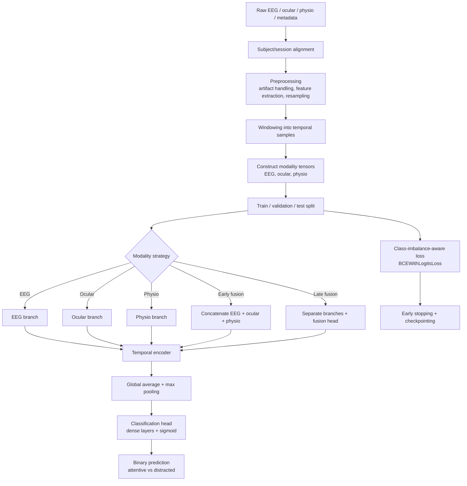
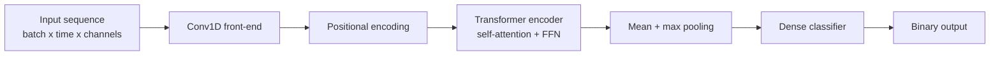
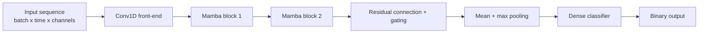
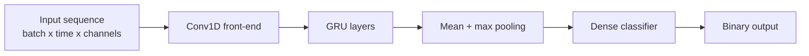
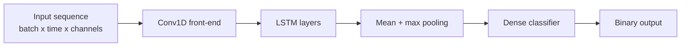

# Progress Report

Generated on 2026-07-21.

## What has been completed so far

- Fixed the EEG file-resolution issue in the preprocessing pipeline so it now uses the actual dataset naming pattern.
- Reworked the cache logic so the preprocessing cache is rebuilt automatically instead of silently reusing stale data.
- Added support for both GRU and LSTM sequence models in the training and evaluation pipeline.
- Improved the trainer with a progress bar, class-imbalance-aware loss handling, and early-stopping behavior.
- Made preprocessing more robust to missing phenotype metadata so missing memory-score values no longer block a trial entirely.
- Generated evaluation artifacts and saved metrics for Experiment 2, Experiment 3, and cross-experiment comparisons.

## End-to-end pipeline overview

The diagram below summarizes the full processing pipeline from raw recordings to final attentive/distracted prediction.

## Model architecture sketches

### Transformer classifier

### Mamba classifier

### GRU classifier

### LSTM classifier

## Current experiment results (window = 20s)

### Experiment 2

| Model | Modality | Accuracy | F1 | AUC |
|---|---|---:|---:|---:|
| GRU | EEG | 0.4906 | 0.6582 | 0.4731 |
| GRU | Ocular | 0.5039 | 0.3931 | 0.5092 |
| GRU | Physio | 0.5087 | 0.1475 | 0.4795 |
| GRU | Early fusion | 0.4976 | 0.6475 | 0.5145 |
| GRU | Late fusion | 0.4858 | 0.5962 | 0.4830 |
| LSTM | EEG | 0.5079 | 0.0064 | 0.5092 |
| LSTM | Ocular | 0.4937 | 0.6610 | 0.4892 |
| LSTM | Physio | 0.4937 | 0.6610 | 0.4950 |
| LSTM | Early fusion | 0.4961 | 0.6610 | 0.5138 |
| LSTM | Late fusion | 0.4937 | 0.6610 | 0.4921 |

### Experiment 3

| Model | Modality | Accuracy | F1 | AUC |
|---|---|---:|---:|---:|
| GRU | EEG | 0.4856 | 0.6530 | 0.5030 |
| GRU | Ocular | 0.5161 | 0.4208 | 0.5058 |
| GRU | Physio | 0.5183 | 0.1459 | 0.5159 |
| GRU | Early fusion | 0.4839 | 0.6321 | 0.5249 |
| GRU | Late fusion | 0.4913 | 0.5967 | 0.5140 |
| LSTM | EEG | 0.5155 | 0.0000 | 0.5328 |
| LSTM | Ocular | 0.4845 | 0.6528 | 0.5117 |
| LSTM | Physio | 0.4845 | 0.6528 | 0.4644 |
| LSTM | Early fusion | 0.4823 | 0.6496 | 0.4768 |
| LSTM | Late fusion | 0.4845 | 0.6528 | 0.4900 |

### Cross-experiment evaluation

| Direction | Model | Modality | Accuracy | F1 | AUC |
|---|---|---|---:|---:|---:|
| Exp2 → Exp3 | GRU | EEG | 0.4854 | 0.6528 | 0.5060 |
| Exp2 → Exp3 | GRU | Ocular | 0.5063 | 0.4121 | 0.4927 |
| Exp2 → Exp3 | GRU | Physio | 0.5150 | 0.1514 | 0.5133 |
| Exp2 → Exp3 | GRU | Early fusion | 0.4879 | 0.6367 | 0.5158 |
| Exp2 → Exp3 | GRU | Late fusion | 0.4851 | 0.5927 | 0.5000 |
| Exp3 → Exp2 | GRU | EEG | 0.4928 | 0.6597 | 0.4845 |
| Exp3 → Exp2 | GRU | Ocular | 0.4865 | 0.3699 | 0.4793 |
| Exp3 → Exp2 | GRU | Physio | 0.5038 | 0.1351 | 0.4821 |
| Exp3 → Exp2 | GRU | Early fusion | 0.4912 | 0.6420 | 0.5170 |
| Exp3 → Exp2 | GRU | Late fusion | 0.4817 | 0.5929 | 0.4693 |
| Exp2 → Exp3 | LSTM | EEG | 0.5155 | 0.0000 | 0.5419 |
| Exp2 → Exp3 | LSTM | Ocular | 0.4845 | 0.6528 | 0.5114 |
| Exp2 → Exp3 | LSTM | Physio | 0.4845 | 0.6528 | 0.4608 |
| Exp2 → Exp3 | LSTM | Early fusion | 0.4848 | 0.6502 | 0.4874 |
| Exp2 → Exp3 | LSTM | Late fusion | 0.4845 | 0.6528 | 0.4921 |
| Exp3 → Exp2 | LSTM | EEG | 0.5065 | 0.0013 | 0.5217 |
| Exp3 → Exp2 | LSTM | Ocular | 0.4939 | 0.6612 | 0.5032 |
| Exp3 → Exp2 | LSTM | Physio | 0.4939 | 0.6612 | 0.4892 |
| Exp3 → Exp2 | LSTM | Early fusion | 0.4957 | 0.6612 | 0.5149 |
| Exp3 → Exp2 | LSTM | Late fusion | 0.4939 | 0.6612 | 0.5005 |

## Generated artifacts

- Metrics: [results/metrics_exp2.json](results/metrics_exp2.json)
- Metrics: [results/metrics_exp3.json](results/metrics_exp3.json)
- Metrics: [results/metrics_cross.json](results/metrics_cross.json)
- Figures: [results](results)
